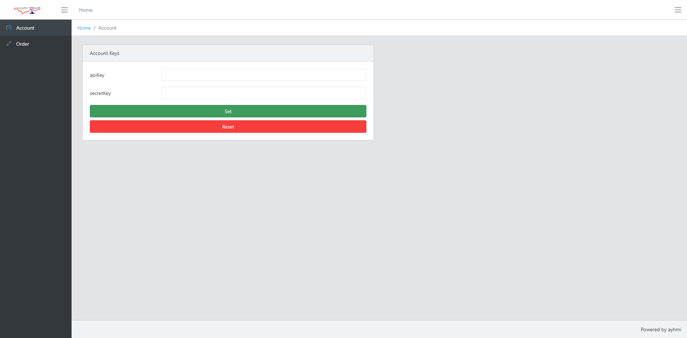
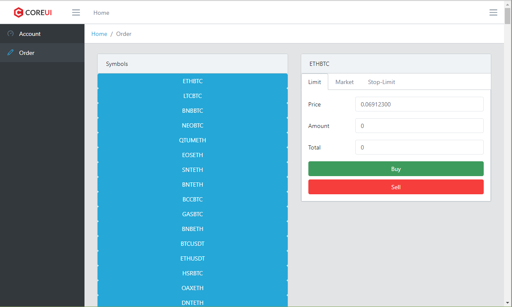

# cryptoBinance

This project helps you to order crypto trading in binance with apiKey and secretKey. 

## Usage

Run 'npm start' for development tests. Production mode is not currently supported.

Open Account page to enter apiKey and secretKey inputs.

Place your orders by selecting the symbol from left and entering the necessary fields from right.

## Development server

Run `ng serve --proxy-config proxy.conf.json` for a dev server. Navigate to `http://localhost:4200/`. The app will automatically reload if you change any of the source files.

## Code scaffolding

Run `ng generate component component-name` to generate a new component. You can also use `ng generate directive|pipe|service|class|guard|interface|enum|module`.

## Build

Run `ng build` to build the project. The build artifacts will be stored in the `dist/` directory. Use the `--prod` flag for a production build.

## Running unit tests

Run `ng test` to execute the unit tests via [Karma](https://karma-runner.github.io).

## Running end-to-end tests

Run `ng e2e` to execute the end-to-end tests via [Protractor](http://www.protractortest.org/).

## Further help

To get more help on the Angular CLI use `ng help` or go check out the [Angular CLI README](https://github.com/angular/angular-cli/blob/master/README.md).
